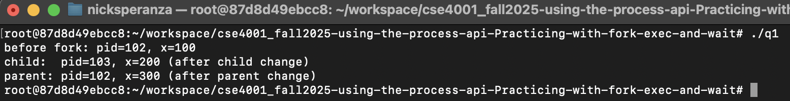
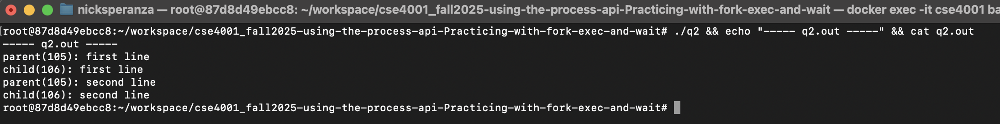
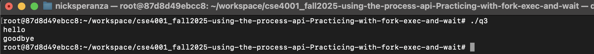
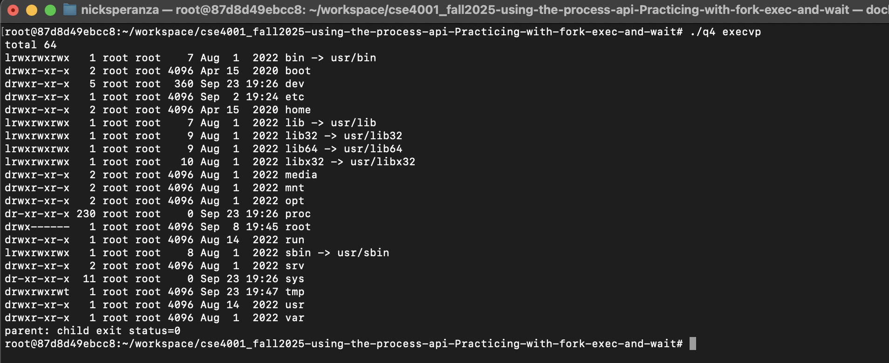
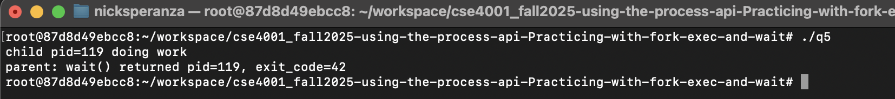
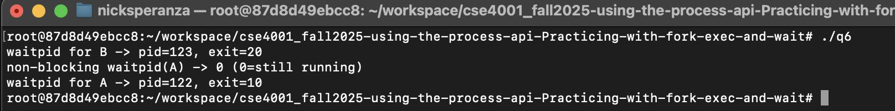
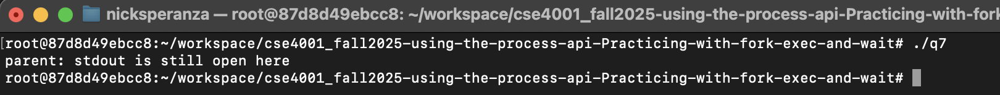

# Assignment: Practicing the Process API
Practicing with fork, exec, wait. 

### Overview

In this assignment, you will practice using the Process API to create processes and run programs under Linux. The goal is to gain hands-on experience with system calls related to process management. Specifically, you will practice using the unix process API functions 'fork()', 'exec()', 'wait()', and 'exit()'. 

⚠️ Note: This is not an OS/161 assignment. You will complete it directly on Linux. 

Use the Linux in your CSE4001 container. If you are using macOS, you may use the Terminal (you may need to install development tools with C/C++ compilers). 

**Reference Reading**: Arpaci-Dusseau, *Operating Systems: Three Easy Pieces*, Chapter 5 (Process API Basics)
 👉 [Chapter 5 PDF](http://pages.cs.wisc.edu/~remzi/OSTEP/cpu-api.pdf)

---

### **Steps to Complete the Assignment**

1. **Accept the GitHub Classroom Invitation**
    [GitHub Link](https://classroom.github.com/a/FZh4BrQG)
2. **Set up your Repository**
   - Clone the assignment repository.
3. **Study the Reference Materials**
   - Read **Chapter 5**.
   - Download and explore the sample programs from the textbook repository:
      [OSTEP CPU API Code](https://github.com/remzi-arpacidusseau/ostep-code/tree/master/cpu-api).
4. **Write Your Programs**
   - Adapt the provided example code to answer the assignment questions.
   - Each program should be clear, well-commented, and compile/run correctly.
   - Add your solution source code to the repository.

5. **Prepare Your Report**
   - Answer the questions in the README.md file. You must edit the README.md file and not create another file with the answers. 
   - For each question:
     - Include your **code**.
     - Provide your **answer/explanation**.
6. **Submit Your Work via GitHub**
   - Push both your **program code** to your assignment repository.
   - This push will serve as your submission.
   - Make sure all files, answers, and screenshots are uploaded and rendered properly.

---
### Questions
1. Write a program that calls `fork()`. Before calling `fork()`, have the main process access a variable (e.g., x) and set its value to something (e.g., 100). What value is the variable in the child process? What happens to the variable when both the child and parent change the value of x?

Code:

#include <stdio.h>
#include <stdlib.h>
#include <unistd.h>

int main(void) {
    int x = 100;
    printf("before fork: pid=%d, x=%d\n", getpid(), x);

    int rc = fork();
    if (rc < 0) { perror("fork"); exit(1); }

    if (rc == 0) {
        x = 200;
        printf("child:  pid=%d, x=%d (after child change)\n", getpid(), x);
    } else {
        x = 300;
        printf("parent: pid=%d, x=%d (after parent change)\n", getpid(), x);
    }
    return 0;
}

2. Write a program that opens a file (with the `open()` system call) and then calls `fork()` to create a new process. Can both the child and parent access the file descriptor returned by `open()`? What happens when they are writing to the file concurrently, i.e., at the same time?

Code:
#define _GNU_SOURCE
#include <stdio.h>
#include <stdlib.h>
#include <unistd.h>
#include <fcntl.h>
#include <sys/wait.h>

int main(void) {
    int fd = open("q2.out", O_CREAT|O_TRUNC|O_WRONLY, 0644);
    if (fd < 0) { perror("open"); exit(1); }

    int rc = fork();
    if (rc < 0) { perror("fork"); exit(1); }

    if (rc == 0) {
        dprintf(fd, "child(%d): first line\n", getpid());
        dprintf(fd, "child(%d): second line\n", getpid());
        close(fd);
        _exit(0);
    } else {
        dprintf(fd, "parent(%d): first line\n", getpid());
        dprintf(fd, "parent(%d): second line\n", getpid());
        close(fd);
        wait(NULL);
    }
    return 0;
}

3. Write another program using `fork()`.The child process should print “hello”; the parent process should print “goodbye”. You should try to ensure that the child process always prints first; can you do this without calling `wait()` in the parent?

Code:
#include <stdio.h>
#include <stdlib.h>
#include <unistd.h>

int main(void) {
    int p[2];
    if (pipe(p) < 0) { perror("pipe"); exit(1); }

    int rc = fork();
    if (rc < 0) { perror("fork"); exit(1); }

    if (rc == 0) {
        close(p[0]);
        puts("hello");
        write(p[1], "x", 1);  // signal parent
        close(p[1]);
        _exit(0);
    } else {
        close(p[1]);
        char buf;
        read(p[0], &buf, 1);  // wait for child
        puts("goodbye");
        close(p[0]);
    }
    return 0;
}

4. Write a program that calls `fork()` and then calls some form of `exec()` to run the program `/bin/ls`. See if you can try all of the variants of `exec()`, including (on Linux) `execl()`, `execle()`, `execlp()`, `execv()`, `execvp()`, and `execvpe()`. Why do you think there are so many variants of the same basic call?

Code:
#define _GNU_SOURCE
#include <stdio.h>
#include <stdlib.h>
#include <unistd.h>
#include <string.h>
#include <sys/wait.h>

extern char **environ;

int child_exec(const char *which) {
    char *const argv_v[] = { "ls", "-l", "/", NULL };
    if      (!strcmp(which, "execl"))   return execl("/bin/ls", "ls", "-l", "/", (char*)NULL);
    else if (!strcmp(which, "execlp"))  return execlp("ls",     "ls", "-l", "/", (char*)NULL);
    else if (!strcmp(which, "execle"))  { char *const envp[] = { "FOO=BAR", NULL };
                                         return execle("/bin/ls","ls","-l","/",(char*)NULL, envp); }
    else if (!strcmp(which, "execv"))   return execv("/bin/ls", (char *const*)argv_v);
    else if (!strcmp(which, "execvp"))  return execvp("ls",     (char *const*)argv_v);
    else if (!strcmp(which, "execvpe")) return execvpe("ls",    (char *const*)argv_v, environ);
    else { fprintf(stderr, "unknown: %s\n", which); return -1; }
}

int main(int argc, char **argv) {
    const char *which = (argc > 1) ? argv[1] : "execvp";
    int rc = fork(); if (rc < 0) { perror("fork"); exit(1); }
    if (rc == 0) {
        child_exec(which);
        perror("exec* failed"); _exit(127);
    } else {
        int status; waitpid(rc, &status, 0);
        printf("parent: child exit status=%d\n", WEXITSTATUS(status));
    }
    return 0;
}

5. Now write a program that uses `wait()` to wait for the child process to finish in the parent. What does `wait()` return? What happens if you use `wait()` in the child?

Code:
#include <stdio.h>
#include <stdlib.h>
#include <unistd.h>
#include <sys/wait.h>

int main(void) {
    int rc = fork();
    if (rc < 0) { perror("fork"); exit(1); }

    if (rc == 0) {
        printf("child pid=%d doing work\n", getpid());
        _exit(42);  // exit code 42
    } else {
        int status = 0;
        pid_t got = wait(&status);
        printf("parent: wait() returned pid=%d, exit_code=%d\n",
               (int)got, WIFEXITED(status) ? WEXITSTATUS(status) : -1);
    }
    return 0;
}

6. Write a slight modification of the previous program, this time using `waitpid()` instead of `wait()`. When would `waitpid()` be useful?

Code:
#include <stdio.h>
#include <stdlib.h>
#include <unistd.h>
#include <sys/wait.h>

int main(void) {
    pid_t a = fork();
    if (a < 0) { perror("fork"); exit(1); }
    if (a == 0) { sleep(2); _exit(10); }  // child A exits later

    pid_t b = fork();
    if (b < 0) { perror("fork"); exit(1); }
    if (b == 0) { _exit(20); }            // child B exits quickly

    int status;
    pid_t got = waitpid(b, &status, 0);
    printf("waitpid for B -> pid=%d, exit=%d\n", (int)got, WEXITSTATUS(status));

    got = waitpid(a, &status, WNOHANG);
    printf("non-blocking waitpid(A) -> %d (0=still running)\n", (int)got);

    got = waitpid(a, &status, 0);
    printf("waitpid for A -> pid=%d, exit=%d\n", (int)got, WEXITSTATUS(status));
    return 0;
}

7. Write a program that creates a child process, and then in the child closes standard output (`STDOUT FILENO`). What happens if the child calls `printf()` to print some output after closing the descriptor?

Code:
#include <stdio.h>
#include <stdlib.h>
#include <unistd.h>
#include <sys/wait.h>

int main(void) {
    int rc = fork();
    if (rc < 0) { perror("fork"); exit(1); }

    if (rc == 0) {
        close(STDOUT_FILENO);
        // stdout is closed; this won't appear on the terminal
        printf("child: you should NOT see this\n");
        // force buffers to flush; if an error occurs, it won't print (stdout is closed)
        fflush(NULL);
        _exit(0);
    } else {
        wait(NULL);
        puts("parent: stdout is still open here");
    }
    return 0;
}

